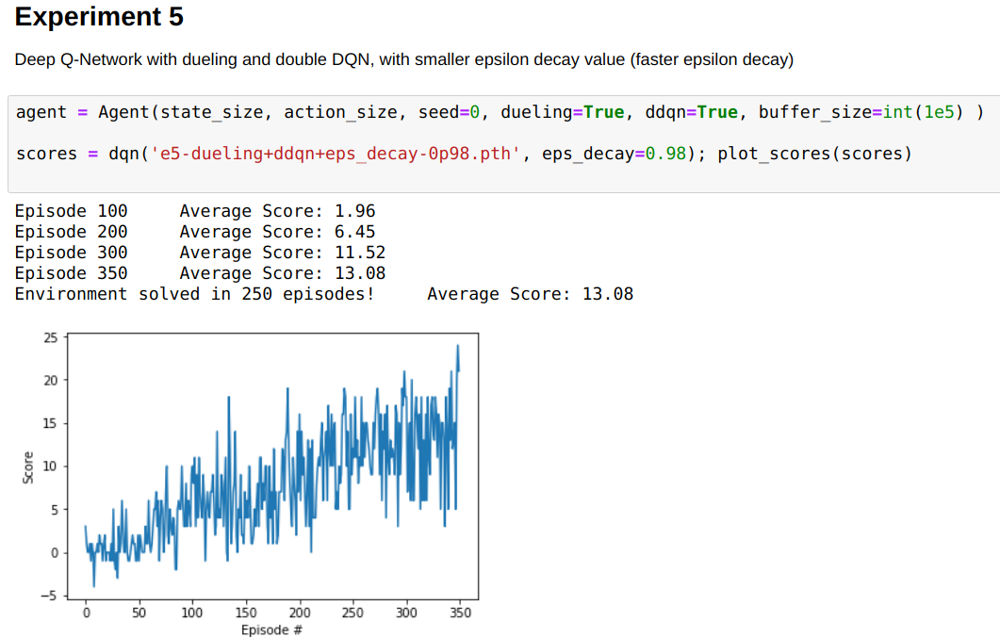

## Project Navigation
##### Implementation of Deep Q-Learning Algorithms for solving navigation in a small virtual environment and item collection

In the project an agent has to learn to collect the maximum number of bananas randomly spread inside a virtual playground. The agent can do basic movement (turning and moving) and every time he find a banana he gets a reward. If the banana is yellow he increases the score, and if case he hits a blue banana, the score decreases by 1. 
The goal of the agent is to maximize the reward score.

The solution of this environment was attempted by implementation a Deep Q-network (DQN) algorithm. The DQN algorithm is a reinforcement learning application via the implementation of Q-learning method combined with a deep learning network. 


Content:
1. Approach 
2. Learning algorithms and code implementation 
3. Results of experiments with different settings and hyperparameter tuning 


### 1. Approach  

The project description, installation and requirements for setting up and running the virtual environment playground are given in the `README.me` in the root of the repository.

In order to complete the project, I started out from the code provided in the OpenAI Gym Lunar Landing example. 
I modified the environment relevant sections of the code in the following way:

```python
# reset the environment
env_info = env.reset(train_mode=True)[brain_name]  # Udacity env 
#state = env.reset()							   # OpenAI-Gyn env

state = env_info.vector_observations[0]            # get the current state
score = 0 
for t in range(max_t):
	action = agent.act(state, eps)

	# In OpenAI Gym env
	#next_state, reward, done, _ = env.step(action)
	#action = np.random.randint(action_size)        # select an action
	
	# In Unity env
	env_info = env.step(action)[brain_name]        # send the action to the environment
	next_state = env_info.vector_observations[0]   # get the next state
	reward = env_info.rewards[0]                   # get the reward
	done = env_info.local_done[0]                  # see if episode has finished
```
 
### 2. Learning algorithms and code implementation

I reference the following sources, as they helped me to get started with the implementation of the algorithm:
- [Navigation project of tommytracey's](https://github.com/tommytracey/DeepRL-P1-Navigation)
- [Navigation project of glebashnik's](https://github.com/glebashnik/udacity-deep-reinforcement-learning-navigation)


#### 2.1 Reinforcement Learning algorithms

The goal of the agent is to interact with the environment by selecting actions in a way that maximizes future rewards. The optimal action-value function (Q) is defined to maximize the expected reward.

Some of the mathematical definitions are summarized in this section:

#### a). Q-learning
Action-value function can be defined as the maximum sum of rewards r<sub>t</sub> discounted by 𝛾 at each timestep t, achievable by a behaviour policy 𝜋=P(a|s), after making an observation (s) and taking an action (a) [[Mnih at al.(2015)](https://storage.googleapis.com/deepmind-media/dqn/DQNNaturePaper.pdf)]

=\underset{\pi}{\mathrm{max}}E[r_{t}&plus;\gamma&space;r_{t&plus;1}&plus;\gamma^2r_{t&plus;2}&plus;...|s_t=s,a_t=a,\pi])

Estimates for the optimal action values can be learned using Q-learning by learning a parameterized value function Q(s, a; θ<sub>t</sub>).
The Q-learning update after action A and state S, immediate reward R <sub>t+1</sub>, and state S<sub>t+1</sub> is:

)\nabla_{\theta_t}Q(S_t,A_t;\theta_t))

From [Hasselt et al.(2015)](https://arxiv.org/pdf/1509.06461.pdf) the __target action-value funtion__ is noted with __Y__, and the reward with capital R
 
=R_{t&plus;1}&plus;\gamma\underset{a}{\mathrm{max}}Q(S_{t&plus;1},a;\theta_{t}))


#### b). Deep Q Networks (DQN)

=R_{t&plus;1}&plus;\gamma\underset{a}{\mathrm{max}}Q(S_{t&plus;1},a;\theta^{-}_{t}))

#### c). Double Q-learning


=R_{t&plus;1}&plus;\gamma&space;Q(S_{t&plus;1},\underset{a}{\mathrm{argmax}}Q(S_{t&plus;1},a;\theta_{t});\theta^{'}_{t}))

#### d). Double Deep Q-Network (DDQN)

DDQN is introduced by the authors in order to reduce overestimations of the network by decomposing the max operation in the target into action selection and action evaluation. 
It is expected that the implementation of the Double Q-learning will reduce overestimations of the Q-learning algorithm. DDQN differs from Double Q-learning only by the weights of the second network which are replaced with the weights of the target network:


=R_{t&plus;1}&plus;\gamma&space;Q(S_{t&plus;1},\underset{a}{\mathrm{argmax}}Q(S_{t&plus;1},a;\theta_{t});\theta^{-}_{t}))

 
The double DQN network was implemented by modifying only the learning method of the Agent class in the `dqn_agent.py`. Instead defining the next targets of the Q-Network as the maximum value of the targets, the states are gathered and the maximum value assigned to the next target

```python
if self.ddqn:
	indices = torch.argmax(self.qnetwork_local(next_states).detach(),1)
	Q_targets_next = self.qnetwork_target(next_states).detach().gather(1,indices.unsqueeze(1))
else:
	Q_targets_next = self.qnetwork_target(next_states).detach().max(1)[0].unsqueeze(1)

```

A very intuitive explanation of the `torch.gather` method can be found in [this post](https://stackoverflow.com/a/54706716/2269826).


#### 2.2. Deep Learning network  

For the implementation of the DQN, the definition of the Deep learning model is required, and in this examples it is given in the `model.py` file. 
In this case a 3 layer fully connected network was used with ReLU activation functions. 


#### 2.3 Dueling network

In the rubric a reference to the paper of [Wang et al (2016)](https://arxiv.org/abs/1511.06581) is provided. 
Implemented in code by modifying the code in `model.py` as follows

```python
# in order to implement dueling the state_value needs to be declared
self.state_value = nn.Linear(fc2_units, 1)
```
and also the forward function in the `QNetwork` was extended so that the final Linear layer in the fully connected network is extended by the state values.

```python 
# use duleling only when required
if self.dueling:
	return self.fc3(x) + self.state_value(x)
else:
	return self.fc3(x)
```


#### 2.4 Epsilon greedy action selection 

The selection of the next action after a step can be made as a random choice. This would correspond to free exploration behavior. The idea of epsilon greedy algorithm is to contain the selection of the next action based on a value epsilon, similar to a threshold value for the random choice of actions. When the epsilon valeu is high, the agent chooses the same actions over and over again, which would lead to poor solutions of the environment. When the epsilon value is low, the choce of the actions are nearly random.
The values of the epsilon can change with the learning progression, by defining a decay factor and end value. In the implementation the epsilon value starts with high values and it is updated to a lower value for each learning step during the agent training. 

The code implementation was present in the example code used from the Lunar landing example and was not modified (in the [`dqn_agent.py`](https://github.com/bkocis/DRLND_Pr_1_Navigation/blob/master/dqn_agent.py#L82#L86).


#### 2.5 Agent training algorithm 

`learning` method of the `Agent` class in the `dqn_agent.py` file

Steps
- the action-value function is initialized 
- the target action-value function is initialized  
- The experience tuples for each timestep are stored in the buffer 
- the buffer is samples and the Q-learning is updated 
- the next steps for the target action-valeu function (`Q_targets_next`) are obtained as the maximum value of the target model
- the target action-value function is computed for the current states (`Q_targets`)
- expected Q-values are obtained from the action-value function (`Q_expected`)
- the Mean-Square-Error loss is calculated between the target and extected action-value functions
- the loss is minimized in the backpropagation step 

The `learn` method is put into action in the `step` method of the `Agent` class. Further on, the `step` methods is executed iterativelly in the `dqn` method of the main code section.


#### 2.6 Replay buffer / experience replay

In the code implementation in the `dqn_agent.py` a fixed size buffer is defined for the storage of the experience tuples. The stored tuples are called randomly in the `sample` method. 
Without the stored experience tuples (action, state, reward, next state), the agent always acts randomly. When the agent has access to previous tuples, it can recall actions that gave positive reward and so repeat certain moves.  

I also investigated the effect of the buffer size on the agent training (see Experiment 8 in the `Navigation.ipynb`).


### 3. Results of experiments with different settings and hyperparameter tuning 

In the course of the DQN code implementation I ran several experiments which are included in the `Navigation.ipynb` notebook. 
In order to have some ground for comparison of the experiments, all of them have to be executed in the same session of environment load. Restarting the notebook between experiments would make the comparison of the hyperparameter tuning results false due to the random placement of bananas at environment initialization. 

The greatest impact on the speed (number of episodes till desired score of 13 was reached) was due to the epsilon greedy algorithm. The `eps_decay` parameter, that sets the epsilon value decrease, was modified in a few experiments. The best agent that reached the target score with the leeast number of training episodes was obtained when the eps_decay value was set to 0.98 (Fig.1.). Lower values did not produce better results, as the agent becomes quite unstable (large score variance). Value of eps_decay equal to 1 in this code implementation would mean no change of the epsilon values, which led to total random choice of actions (Experiment 7 in the `Navigation.ipynb`). 




__Fig__.__1__ Best result in 250 episodes.


Implementation of dueling and double DQN resulted only in a slight improvement in solving the environment, when both were used together. 

Replay buffer size experiments show that that size of the memory buffer for storing the experience tuples has to be around 1e5. Interestingly, higher values for the buffer size (1e8) did not improve the overall agent performance. 


The results of the agent training models are compared in the end using the `test(agent)` method (see Fig.2.). The rolling mean value of the episode average scores have been calculated for each of the experiments. The results show that indeed the best performing agent is trained with the eps_decay value of 0.98 ( e5 marked with purple line in the plot).


__Fig__.__2__ Comparison of test run of the agents trained in the experiments. The plot shows the rolling mean value of the average scores in end of episodes.


Log of the experiments: 

Note: `n_episodes` limit was set to 800

|Experiment ID | *pth filename | #episode at score > 13 | eps_decay | dueling DQN | double DQN | Replay buffer size | Note |
|---|---|---|---|---|---|---| --- |
| 1 |'e1-initial.pth'| 418 | 0.995 | False | False | 1e5 | |
| 2 |'e2-dueling.pth'| 430 | 0.995 | True | False | 1e5 | |
| 3 |'e3-ddqn.pth'| 423 | 0.995 | False | True | 1e5 | |
| 4 |'e4-dueling+ddqn.pth'| 409 | 0.995 | True | True | 1e5 | |
| 5 |'e5-dueling+ddqn+eps_decay-0p98.pth'| 250 | 0.98 | True | True | 1e5 | |
| 6 |'e6-dueling+ddqn+eps_decay-0p97.pth'| 378 | 0.97 | True | True | 1e5 | |
| 7 |NaN | NaN | 1.0  | True | True | 1e5 | checkpoint not save - totaly random agent, scores average at 0|
| 8a |NaN| NaN | 0.98 | True | True |1e3 | after 800 episodes the score was ~12 |  
| 8b |'e8-dqn_Replay_Buffer-1e5.pth'| 268 | 0.98 | True | True | 1e5 | |  
| 8c |'e8-dqn_Replay_Buffer-1e8.pth'| 299 | 0.98 | True | True | 1e8 | |  


### 4. Ideas for future work for agent performance improvement 

- Grid search and hyperparameter tuning - extensive search in the solution space might result in 

- Algorithm improvement: the scores of the training fluctuate a lot (see in Fig.1.), and apparently, it correlated with the length of the training (number of episodes). In this example the decay is linear (line `eps = max(eps_end, eps_decay*eps) # decrease epsilon` in the `dqn` method). Maybe an alternative function for the epsilon decay can be implemented for example `eps_decay*eps**2` of `eps_decay*exp(eps)`. 

- Prioritized experience replay - in the current implementation the code contains experience replay. Further work could be done on the implementation of Prioritized experience replay. 

- Learning from pixels 

In the project, your agent learned from information such as its velocity, along with ray-based perception of objects around its forward direction.  A more challenging task would be to learn directly from pixels!

Unity environment.  This environment is almost identical to the project environment, where the only difference is that the state is an 84 x 84 RGB image, corresponding to the agent's first-person view.

Select the environment that matches your operating system:
- Linux: [click here](https://s3-us-west-1.amazonaws.com/udacity-drlnd/P1/Banana/VisualBanana_Linux.zip)
- Mac OSX: [click here](https://s3-us-west-1.amazonaws.com/udacity-drlnd/P1/Banana/VisualBanana.app.zip)
- Windows (32-bit): [click here](https://s3-us-west-1.amazonaws.com/udacity-drlnd/P1/Banana/VisualBanana_Windows_x86.zip)
- Windows (64-bit): [click here](https://s3-us-west-1.amazonaws.com/udacity-drlnd/P1/Banana/VisualBanana_Windows_x86_64.zip)

Then, place the file in the `p1_navigation/` folder in the DRLND GitHub repository, and unzip (or decompress) the file.  Next, open `Navigation_Pixels.ipynb` and follow the instructions to learn how to use the Python API to control the agent.

(_For AWS_) If you'd like to train the agent on AWS, you must follow the instructions to [set up X Server](https://github.com/Unity-Technologies/ml-agents/blob/master/docs/Training-on-Amazon-Web-Service.md), and then download the environment for the **Linux** operating system above.

